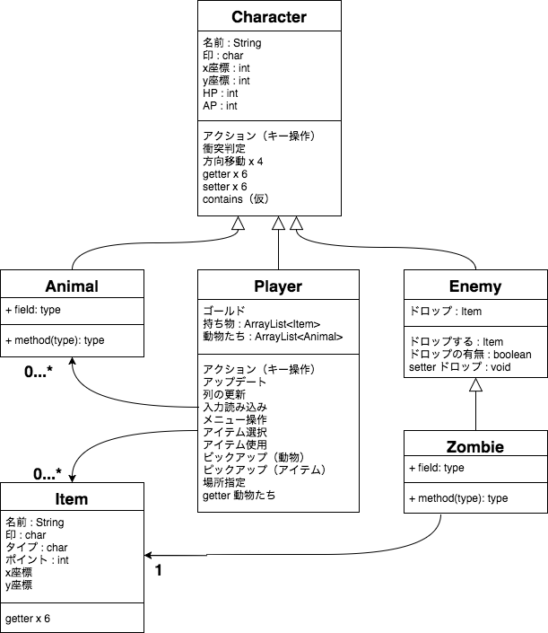

### オブジェクト指向な桃太郎
Hosted at https://github.com/kokimame/momotaro

ストーリーはstory.txt　クラス図はmomos_classes.pngに掲載

## ストーリー
> 「桃太郎」が、お婆さんから黍団子（きびだんご）を貰って、イヌ、サル、キジを従えて、鬼ヶ島まで鬼を退治しに行く物語。（引用：Wikipedia）
> 道中，ゾンビ等のモダンな魑魅魍魎が遭遇することも

## クラス図

