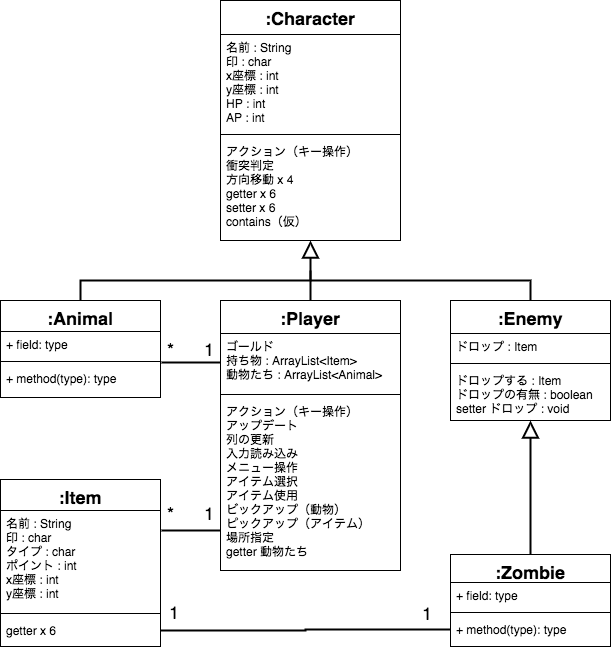

### はりぼて roguelike RPG
Hosted at https://github.com/kokimame/textile

ストーリーはstory.txt　クラス図はclass_diagram.pngに掲載

## ストーリー
> とある世界において，PlayerがEnemyに立ち向かいながら冒険をしていた．
> 今Playerがいる場所は，荒廃した場所で，EnemyとしてZombieにあふれている．
> PlayerとEnemyは共に，HP(Heart Point)とAP(Attack Point)を有しており，戦うことでPlayerは目的地へと突き進む．
> そこで，PlayerはItemを駆使して，回復や攻撃力を上昇させ，生存を第一に目的地へと向かうのであった．

## クラス図

